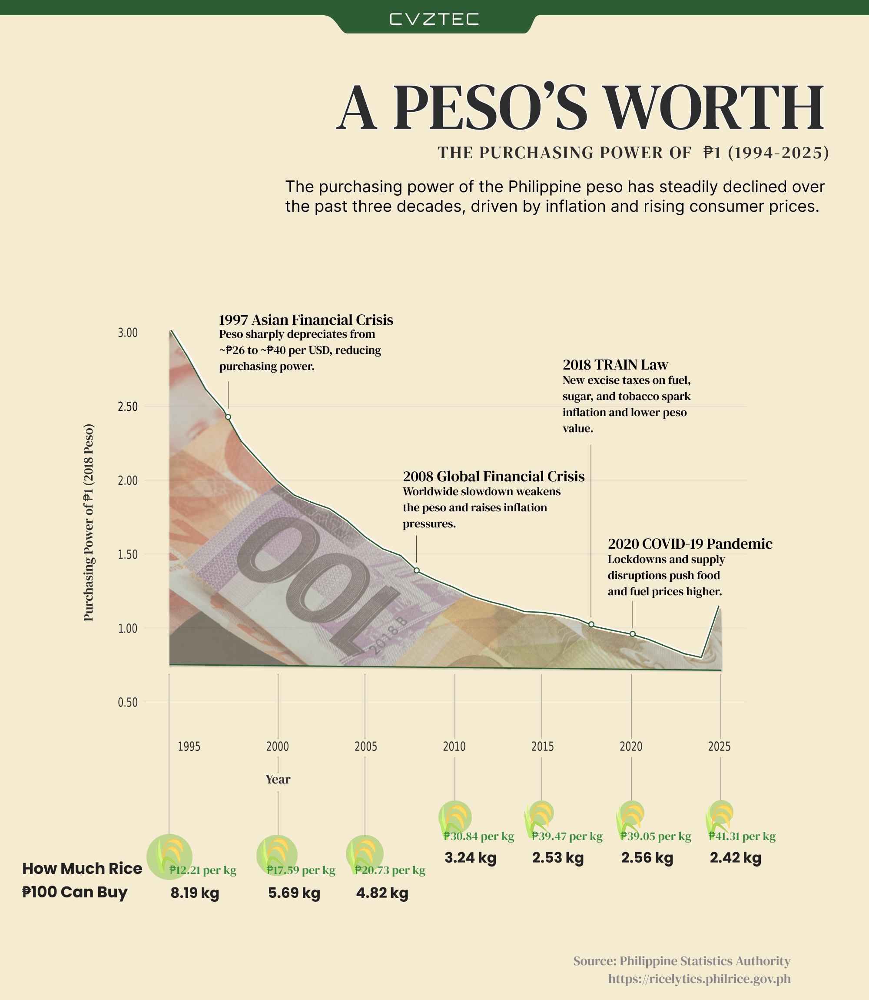
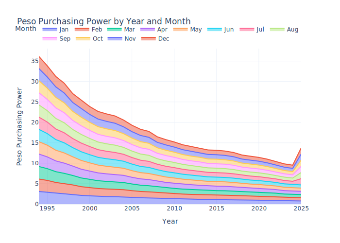

# Philippines Peso Purchasing Power Analysis (1984–2025)

This project analyzes the purchasing power of the Philippine Peso from 1984 to 2025, using 2018 as the base year. Data was cleaned and processed using Python, and interactive visualizations were created with Plotly. Visual elements and infographics were designed in Figma. The repository contains Python scripts for data processing, Jupyter notebooks for exploratory analysis, and CSV files with historical economic data. Results help illustrate how inflation and economic factors have affected the real value of the peso across decades.

## Visualizations

- **A Peso’s Worth Infographic:**  
    
  Key events and rice purchasing power over time (designed in Figma).

- **Peso Purchasing Power by Year and Month:**  
    
  Interactive chart showing monthly and yearly trends (built with Plotly).

## Contents

- **data/**: Raw and processed datasets (CSV)
- **notebooks/**: Jupyter notebooks for analysis and visualization
- **src/**: Python scripts for data cleaning, inflation adjustment, and plotting
- **images/**: Infographics and charts
- **README.md**: Project overview and instructions

## Usage

1. Clone the repository.
2. Install required Python packages from `requirements.txt`.
3. Run the notebooks or scripts to reproduce the analysis.

## License

MIT License

